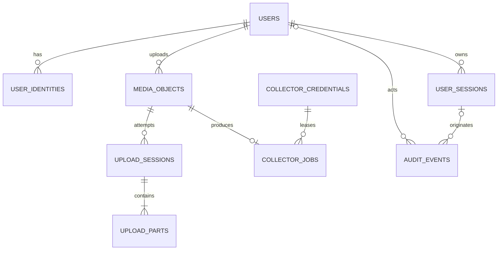

# 私有素材上传系统数据库设计

> 文档状态：待评审
> 版本：1.0
> 日期：2026-07-14
> 数据库：PostgreSQL 17
> 关联文档：[架构设计](../superpowers/specs/2026-07-14-wechat-private-media-upload-design.md) · [接口设计](../api/media-upload-api.md)

## 1. 设计原则

1. 内部主键使用应用生成的 UUIDv7。数据库将其视为不透明 UUID。
2. 微信 `openid` 的唯一范围是小程序 AppID，因此身份唯一键为 `(provider, app_id, openid)`。
3. 昵称可以为空直到首次上传确认，可以重复和修改，不能用于授权或对象路径。
4. 媒体对象、上传会话、分片和采集任务分别建模，避免一个状态字段承担多套状态机。
5. 原文件名只用于展示；R2 object key 必须由服务端生成。
6. 单文件范围为 `12 bytes` 至 `200 MiB = 209,715,200 bytes`；分片固定为 `8 MiB = 8,388,608 bytes`，最多 25 片。
7. PostgreSQL 与 R2 不存在分布式事务，使用幂等操作、固定对象键和对账任务恢复。
8. R2 Multipart ETag 不能当作完整文件 MD5；完整 SHA-256 由采集服务器下载后计算。
9. 完整媒体对象和采集结果首版不自动删除；任何物理删除都必须是后续明确审批的管理操作。

## 2. 状态定义

### 2.1 媒体存储状态

| 状态 | 含义 |
|---|---|
| `pending_upload` | 已预留对象键，完整 R2 对象尚不可用 |
| `ready` | R2 对象已完成并通过 HEAD 大小校验 |
| `failed` | 上传流程不可恢复失败，没有可用完整对象 |
| `aborted` | 用户中止，完整对象不可用 |
| `purged` | 管理操作已确认 R2 对象不存在；首版不会自动进入此状态 |

### 2.2 上传会话状态

| 状态 | 含义 |
|---|---|
| `initiating` | 数据库记录已创建，正在创建 R2 multipart |
| `uploading` | 客户端可以上传或重传分片 |
| `completing` | 正在 ListParts、CompleteMultipartUpload 与 HEAD 对账 |
| `completed` | 完整对象已确认可用 |
| `aborting` | 正在终止 multipart |
| `aborted` | 主动中止完成 |
| `expired` | initiating/uploading 超过 24 小时，或 completing 经 R2 对账确认未完成后，已完成安全清理 |
| `failed` | 不可自动恢复失败 |

### 2.3 分片状态

| 状态 | 含义 |
|---|---|
| `pending` | 尚未得到服务端确认 |
| `uploaded` | R2 UploadPart 成功并保存 ETag 与哈希 |
| `verified` | Complete 前通过 R2 ListParts 复核 |

API 详情可返回 `pending | uploaded | verified`。客户端只在会话仍为 `uploading` 时重传 `pending`；`uploaded` 与 `verified` 均不得重传。

### 2.4 采集任务状态

| 状态 | 含义 |
|---|---|
| `queued` | 可以立即领取 |
| `leased` | 已被采集服务器持有有效租约 |
| `retry_wait` | 失败后等待下一次领取 |
| `succeeded` | 已确认最终采集成功 |
| `dead` | 不可重试或达到 5 次上限 |
| `cancelled` | 由受控管理操作取消；首版用户端不产生此状态 |

### 2.5 用户聚合状态

用户接口不直接返回上述数据库状态组合，而是投影为：

```text
uploading | finalizing | cancelling | awaiting_collection | collecting | collected |
upload_failed | collection_failed | aborted | expired
```

聚合逻辑：

| 条件 | 用户状态 |
|---|---|
| upload session 为 initiating/uploading | `uploading` |
| upload session 为 completing | `finalizing` |
| upload session 为 aborting | `cancelling` |
| media ready 且 job queued/retry_wait | `awaiting_collection` |
| job leased | `collecting` |
| job succeeded | `collected` |
| upload/media failed | `upload_failed` |
| job dead | `collection_failed` |
| job cancelled | `collection_failed`，失败码为 `COLLECTION_CANCELLED_BY_ADMIN` |
| upload aborted | `aborted` |
| upload expired | `expired` |

## 3. ER 关系



`idempotency_records` 通过 `resource_type/resource_id` 逻辑关联资源，不使用多态外键。

## 4. 表清单

| 表 | 用途 |
|---|---|
| `users` | 内部用户及昵称资料 |
| `user_identities` | AppID + openid 到内部用户的映射 |
| `user_sessions` | Refresh Token 轮换、撤销与重用检测 |
| `media_objects` | 原始素材与 R2 完整对象元数据 |
| `upload_sessions` | 一次 R2 multipart 上传会话 |
| `upload_parts` | 计划分片及服务端确认结果 |
| `collector_credentials` | 采集服务器 API Key 摘要与 scope |
| `collector_jobs` | 采集任务、租约、重试及结果 |
| `idempotency_records` | 跨请求幂等账本 |
| `audit_events` | 不可变业务审计事件 |

## 5. PostgreSQL DDL 草案

以下 DDL 用于约束模型和生成首批 migration；正式 migration 需按文件拆分并在测试库验证。

### 5.1 扩展、Schema 与枚举

```sql
CREATE EXTENSION IF NOT EXISTS pgcrypto;

CREATE SCHEMA IF NOT EXISTS media_app;
SET search_path = media_app, public;

CREATE TYPE user_status AS ENUM (
  'active', 'disabled', 'deleted'
);

CREATE TYPE identity_provider AS ENUM (
  'wechat_miniprogram'
);

CREATE TYPE media_kind AS ENUM (
  'image', 'video'
);

CREATE TYPE media_storage_status AS ENUM (
  'pending_upload', 'ready', 'failed', 'aborted', 'purged'
);

CREATE TYPE upload_session_status AS ENUM (
  'initiating', 'uploading', 'completing', 'completed',
  'aborting', 'aborted', 'expired', 'failed'
);

CREATE TYPE upload_part_status AS ENUM (
  'pending', 'uploaded', 'verified'
);

CREATE TYPE collector_job_status AS ENUM (
  'queued', 'leased', 'retry_wait', 'succeeded', 'dead', 'cancelled'
);

CREATE TYPE credential_status AS ENUM (
  'active', 'revoked', 'expired'
);

CREATE TYPE idempotency_status AS ENUM (
  'in_progress', 'completed', 'failed'
);

CREATE TYPE audit_actor_type AS ENUM (
  'user', 'collector', 'system', 'admin'
);
```

### 5.2 用户与微信身份

```sql
CREATE TABLE users (
  id                     uuid PRIMARY KEY,
  status                 user_status NOT NULL DEFAULT 'active',
  nickname               text,
  nickname_confirmed_at  timestamptz,
  last_seen_at           timestamptz,
  created_at             timestamptz NOT NULL DEFAULT clock_timestamp(),
  updated_at             timestamptz NOT NULL DEFAULT clock_timestamp(),
  row_version            bigint NOT NULL DEFAULT 0,

  CONSTRAINT ck_users_nickname CHECK (
    nickname IS NULL OR (
      char_length(btrim(nickname)) >= 1
      AND octet_length(nickname) <= 128
    )
  ),
  CONSTRAINT ck_users_nickname_confirmation CHECK (
    nickname_confirmed_at IS NULL OR nickname IS NOT NULL
  ),
  CONSTRAINT ck_users_version CHECK (row_version >= 0)
);

CREATE TABLE user_identities (
  id             uuid PRIMARY KEY,
  user_id        uuid NOT NULL REFERENCES users(id) ON DELETE RESTRICT,
  provider       identity_provider NOT NULL,
  app_id         varchar(64) COLLATE "C" NOT NULL,
  openid         varchar(128) COLLATE "C" NOT NULL,
  unionid        varchar(128) COLLATE "C",
  last_login_at  timestamptz NOT NULL DEFAULT clock_timestamp(),
  created_at     timestamptz NOT NULL DEFAULT clock_timestamp(),

  CONSTRAINT uq_identity_subject UNIQUE (provider, app_id, openid),
  CONSTRAINT uq_identity_user_app UNIQUE (user_id, provider, app_id),
  CONSTRAINT ck_identity_app_id CHECK (
    char_length(btrim(app_id)) BETWEEN 1 AND 64
  ),
  CONSTRAINT ck_identity_openid CHECK (
    char_length(btrim(openid)) BETWEEN 1 AND 128
  ),
  CONSTRAINT ck_identity_unionid CHECK (
    unionid IS NULL OR char_length(btrim(unionid)) BETWEEN 1 AND 128
  )
);

CREATE INDEX ix_user_identities_user ON user_identities (user_id);
```

`unionid` 不直接设置全局唯一，因为其语义依赖微信开放平台主体。若未来使用 UnionID 合并身份，必须增加明确的开放平台 scope 后建立联合唯一约束。

`openid → userId → nickname` 采用规范化关系而不是重复保存昵称，身份服务内部查询为：

```text
SELECT i.app_id, i.openid, u.id AS user_id,
       u.nickname, u.nickname_confirmed_at
FROM media_app.user_identities AS i
JOIN media_app.users AS u ON u.id = i.user_id
WHERE i.provider = 'wechat_miniprogram'
  AND i.app_id = $1
  AND i.openid = $2;
```

该查询及 `openid` 字段只授权给身份模块；普通上传查询、用户 API、对象键和日志均不暴露 `openid`。

### 5.3 登录会话

```sql
CREATE TABLE user_sessions (
  id                        uuid PRIMARY KEY,
  user_id                   uuid NOT NULL REFERENCES users(id) ON DELETE CASCADE,
  token_family_id           uuid NOT NULL,
  rotated_from_session_id   uuid REFERENCES user_sessions(id) ON DELETE SET NULL,
  refresh_token_hash        bytea NOT NULL,
  device_id                 varchar(128),
  issued_at                 timestamptz NOT NULL DEFAULT clock_timestamp(),
  expires_at                timestamptz NOT NULL,
  last_used_at              timestamptz,
  revoked_at                timestamptz,
  revoke_reason             varchar(64),
  reuse_detected_at         timestamptz,
  source_ip                 inet,
  user_agent                text,

  CONSTRAINT uq_session_refresh_hash UNIQUE (refresh_token_hash),
  CONSTRAINT ck_session_hash CHECK (octet_length(refresh_token_hash) = 32),
  CONSTRAINT ck_session_expiry CHECK (expires_at > issued_at),
  CONSTRAINT ck_session_revoked CHECK (
    revoked_at IS NULL OR revoked_at >= issued_at
  ),
  CONSTRAINT ck_session_reuse CHECK (
    reuse_detected_at IS NULL OR reuse_detected_at >= issued_at
  )
);

CREATE INDEX ix_user_sessions_active
  ON user_sessions (user_id, expires_at DESC)
  WHERE revoked_at IS NULL;

CREATE INDEX ix_user_sessions_family
  ON user_sessions (token_family_id);
```

Refresh Token 明文只返回一次；数据库保存 `SHA-256(token)`。轮换时旧会话与新会话共享 `token_family_id`。旧 Token 重用会在同一事务中撤销该 family 的所有活跃会话。

### 5.4 媒体对象

```sql
CREATE TABLE media_objects (
  id                          uuid PRIMARY KEY,
  user_id                     uuid NOT NULL REFERENCES users(id) ON DELETE RESTRICT,
  kind                        media_kind NOT NULL,
  storage_status              media_storage_status NOT NULL DEFAULT 'pending_upload',

  original_filename           varchar(255) NOT NULL,
  uploader_nickname_snapshot  text NOT NULL,
  declared_content_type       varchar(127) NOT NULL,
  verified_content_type       varchar(127),
  canonical_extension         varchar(16) NOT NULL,
  declared_size_bytes         bigint NOT NULL,
  verified_size_bytes         bigint,

  r2_bucket                   varchar(255) COLLATE "C" NOT NULL,
  object_key                  varchar(1024) COLLATE "C" NOT NULL,
  object_etag                 varchar(1024),
  checksum_sha256             bytea,

  create_idempotency_key      varchar(128) COLLATE "C" NOT NULL,
  uploaded_at                 timestamptz,
  collected_at                timestamptz,
  failed_at                   timestamptz,
  failure_code                varchar(64),
  purged_at                   timestamptz,
  created_at                  timestamptz NOT NULL DEFAULT clock_timestamp(),
  updated_at                  timestamptz NOT NULL DEFAULT clock_timestamp(),
  row_version                 bigint NOT NULL DEFAULT 0,

  CONSTRAINT uq_media_object_key UNIQUE (r2_bucket, object_key),
  CONSTRAINT uq_media_user_idempotency UNIQUE (user_id, create_idempotency_key),
  CONSTRAINT uq_media_id_user UNIQUE (id, user_id),
  CONSTRAINT ck_media_filename CHECK (
    char_length(btrim(original_filename)) >= 1
    AND octet_length(original_filename) <= 255
  ),
  CONSTRAINT ck_media_nickname_snapshot CHECK (
    char_length(btrim(uploader_nickname_snapshot)) >= 1
    AND octet_length(uploader_nickname_snapshot) <= 128
  ),
  CONSTRAINT ck_media_size CHECK (
    declared_size_bytes BETWEEN 12 AND 209715200
    AND (
      verified_size_bytes IS NULL
      OR verified_size_bytes BETWEEN 12 AND 209715200
    )
  ),
  CONSTRAINT ck_media_declared_type CHECK (
    (kind = 'image' AND declared_content_type LIKE 'image/%')
    OR (kind = 'video' AND declared_content_type LIKE 'video/%')
  ),
  CONSTRAINT ck_media_verified_type CHECK (
    verified_content_type IS NULL
    OR (kind = 'image' AND verified_content_type LIKE 'image/%')
    OR (kind = 'video' AND verified_content_type LIKE 'video/%')
  ),
  CONSTRAINT ck_media_extension CHECK (
    canonical_extension ~ '^\.[a-z0-9]{1,10}$'
  ),
  CONSTRAINT ck_media_object_key CHECK (
    octet_length(object_key) BETWEEN 1 AND 1024
    AND object_key !~ '(^/|[[:cntrl:]])'
    AND object_key !~ '(^|/)\.\.(/|$)'
  ),
  CONSTRAINT ck_media_checksum CHECK (
    checksum_sha256 IS NULL OR octet_length(checksum_sha256) = 32
  ),
  CONSTRAINT ck_media_ready_fields CHECK (
    storage_status <> 'ready'
    OR (
      verified_content_type IS NOT NULL
      AND verified_size_bytes IS NOT NULL
      AND object_etag IS NOT NULL
      AND uploaded_at IS NOT NULL
    )
  ),
  CONSTRAINT ck_media_failed_fields CHECK (
    storage_status <> 'failed'
    OR (failed_at IS NOT NULL AND failure_code IS NOT NULL)
  ),
  CONSTRAINT ck_media_purged CHECK (
    (storage_status = 'purged') = (purged_at IS NOT NULL)
  ),
  CONSTRAINT ck_media_collected_after_upload CHECK (
    collected_at IS NULL OR (uploaded_at IS NOT NULL AND collected_at >= uploaded_at)
  ),
  CONSTRAINT ck_media_version CHECK (row_version >= 0)
);

CREATE INDEX ix_media_user_history
  ON media_objects (user_id, created_at DESC, id DESC);

CREATE INDEX ix_media_storage_status
  ON media_objects (storage_status, created_at)
  WHERE storage_status IN ('pending_upload', 'failed');
```

对象键格式由应用验证：

```text
users/{userId}/{image|video}/{yyyy}/{mm}/{mediaId}{canonicalExtension}
```

`canonicalExtension` 包含前导点。数据库只保证无路径穿越和全局唯一；不能依赖 CHECK 表达完整业务正则。

### 5.5 Multipart 上传会话

```sql
CREATE TABLE upload_sessions (
  id                       uuid PRIMARY KEY,
  media_object_id          uuid NOT NULL,
  user_id                  uuid NOT NULL,
  status                   upload_session_status NOT NULL DEFAULT 'initiating',
  r2_upload_id             varchar(1024) COLLATE "C",

  expected_size_bytes      bigint NOT NULL,
  part_size_bytes          integer NOT NULL DEFAULT 8388608,
  expected_part_count      smallint GENERATED ALWAYS AS (
    ((expected_size_bytes + part_size_bytes - 1) / part_size_bytes)::smallint
  ) STORED,
  confirmed_size_bytes     bigint NOT NULL DEFAULT 0,
  confirmed_part_count     smallint NOT NULL DEFAULT 0,
  finalize_attempt_count   integer NOT NULL DEFAULT 0,
  next_finalize_at         timestamptz,
  last_finalize_error_code varchar(64),
  last_finalize_error_at   timestamptz,

  expires_at               timestamptz NOT NULL,
  last_activity_at         timestamptz NOT NULL DEFAULT clock_timestamp(),
  completed_at             timestamptz,
  aborted_at               timestamptz,
  expired_at               timestamptz,
  failed_at                timestamptz,
  failure_code             varchar(64),
  failure_detail           varchar(1000),
  created_at               timestamptz NOT NULL DEFAULT clock_timestamp(),
  updated_at               timestamptz NOT NULL DEFAULT clock_timestamp(),
  row_version              bigint NOT NULL DEFAULT 0,

  CONSTRAINT fk_upload_media_owner
    FOREIGN KEY (media_object_id, user_id)
    REFERENCES media_objects (id, user_id)
    ON DELETE CASCADE,
  CONSTRAINT uq_upload_media UNIQUE (media_object_id),
  CONSTRAINT uq_upload_r2_id UNIQUE (r2_upload_id),
  CONSTRAINT ck_upload_size CHECK (
    expected_size_bytes BETWEEN 12 AND 209715200
  ),
  CONSTRAINT ck_upload_part_size CHECK (part_size_bytes = 8388608),
  CONSTRAINT ck_upload_part_count CHECK (expected_part_count BETWEEN 1 AND 25),
  CONSTRAINT ck_upload_confirmed_progress CHECK (
    confirmed_size_bytes BETWEEN 0 AND expected_size_bytes
    AND confirmed_part_count BETWEEN 0 AND expected_part_count
  ),
  CONSTRAINT ck_upload_finalize_attempts CHECK (finalize_attempt_count >= 0),
  CONSTRAINT ck_upload_finalize_schedule CHECK (
    (status = 'completing') = (next_finalize_at IS NOT NULL)
  ),
  CONSTRAINT ck_upload_finalize_error CHECK (
    (last_finalize_error_code IS NULL) = (last_finalize_error_at IS NULL)
  ),
  CONSTRAINT ck_upload_expiry CHECK (expires_at > created_at),
  CONSTRAINT ck_upload_r2_required CHECK (
    status NOT IN ('uploading', 'completing', 'completed')
    OR r2_upload_id IS NOT NULL
  ),
  CONSTRAINT ck_upload_completed CHECK (
    ((status = 'completed') = (completed_at IS NOT NULL))
    AND (
      status <> 'completed'
      OR (
        confirmed_size_bytes = expected_size_bytes
        AND confirmed_part_count = expected_part_count
      )
    )
  ),
  CONSTRAINT ck_upload_aborted CHECK (
    (status = 'aborted') = (aborted_at IS NOT NULL)
  ),
  CONSTRAINT ck_upload_expired CHECK (
    (status = 'expired') = (expired_at IS NOT NULL)
  ),
  CONSTRAINT ck_upload_failed CHECK (
    status <> 'failed' OR (failed_at IS NOT NULL AND failure_code IS NOT NULL)
  ),
  CONSTRAINT ck_upload_version CHECK (row_version >= 0)
);

CREATE INDEX ix_upload_user_history
  ON upload_sessions (user_id, created_at DESC, id DESC);

CREATE INDEX ix_upload_expiry
  ON upload_sessions (expires_at)
  WHERE status IN ('initiating', 'uploading');

CREATE INDEX ix_upload_finalize_due
  ON upload_sessions (next_finalize_at, id)
  WHERE status = 'completing';

CREATE INDEX ix_upload_reconcile_stuck
  ON upload_sessions (status, last_activity_at, id)
  WHERE status IN ('initiating', 'completing', 'aborting');
```

每个媒体记录只对应一个上传会话。活跃会话内可重传分片；会话进入不可恢复的 `failed/aborted/expired` 后，用户重新上传会创建新的媒体记录和上传会话，旧记录保留在历史中。

`last_activity_at` 在成功确认分片或进入 `completing/aborting` 时更新，用于判断状态持续时长；finalizer 的失败重试只更新 `next_finalize_at` 和错误字段，不推进 `last_activity_at`，否则会掩盖长期卡住告警。

### 5.6 上传分片

```sql
CREATE TABLE upload_parts (
  upload_session_id    uuid NOT NULL
                         REFERENCES upload_sessions(id) ON DELETE CASCADE,
  part_number          smallint NOT NULL,
  status               upload_part_status NOT NULL DEFAULT 'pending',
  offset_bytes         bigint NOT NULL,
  expected_size_bytes  integer NOT NULL,
  actual_size_bytes    integer,
  checksum_sha256      bytea,
  r2_etag              varchar(1024),
  attempt_count        integer NOT NULL DEFAULT 0,
  uploaded_at          timestamptz,
  verified_at          timestamptz,
  created_at           timestamptz NOT NULL DEFAULT clock_timestamp(),
  updated_at           timestamptz NOT NULL DEFAULT clock_timestamp(),
  row_version          bigint NOT NULL DEFAULT 0,

  PRIMARY KEY (upload_session_id, part_number),
  CONSTRAINT ck_part_number CHECK (part_number BETWEEN 1 AND 25),
  CONSTRAINT ck_part_offset CHECK (offset_bytes >= 0),
  CONSTRAINT ck_part_expected_size CHECK (
    expected_size_bytes BETWEEN 1 AND 8388608
  ),
  CONSTRAINT ck_part_actual_size CHECK (
    actual_size_bytes IS NULL
    OR actual_size_bytes BETWEEN 1 AND 8388608
  ),
  CONSTRAINT ck_part_checksum CHECK (
    checksum_sha256 IS NULL OR octet_length(checksum_sha256) = 32
  ),
  CONSTRAINT ck_part_attempts CHECK (attempt_count >= 0),
  CONSTRAINT ck_part_uploaded_fields CHECK (
    status = 'pending'
    OR (
      actual_size_bytes IS NOT NULL
      AND checksum_sha256 IS NOT NULL
      AND r2_etag IS NOT NULL
      AND uploaded_at IS NOT NULL
    )
  ),
  CONSTRAINT ck_part_verified_fields CHECK (
    status <> 'verified' OR verified_at IS NOT NULL
  ),
  CONSTRAINT ck_part_version CHECK (row_version >= 0)
);

CREATE INDEX ix_upload_parts_status
  ON upload_parts (upload_session_id, status, part_number);
```

应用在创建会话时一次性插入 1–25 行分片计划，并验证：

- `offset_bytes = (part_number - 1) × 8 MiB`。
- 非最后片等于 8 MiB。
- 最后一片等于 `expected_size - offset`。
- 所有分片大小之和等于会话期望大小。

### 5.7 采集机器凭据

```sql
CREATE TABLE collector_credentials (
  id               uuid PRIMARY KEY,
  name             varchar(128) NOT NULL,
  token_prefix     varchar(64) COLLATE "C" NOT NULL,
  token_hash       bytea NOT NULL,
  scopes           text[] NOT NULL,
  status           credential_status NOT NULL DEFAULT 'active',
  max_active_jobs  smallint NOT NULL DEFAULT 10,
  expires_at       timestamptz,
  last_used_at     timestamptz,
  created_at       timestamptz NOT NULL DEFAULT clock_timestamp(),
  updated_at       timestamptz NOT NULL DEFAULT clock_timestamp(),
  row_version      bigint NOT NULL DEFAULT 0,

  CONSTRAINT uq_collector_name UNIQUE (name),
  CONSTRAINT uq_collector_prefix UNIQUE (token_prefix),
  CONSTRAINT uq_collector_hash UNIQUE (token_hash),
  CONSTRAINT ck_collector_hash CHECK (octet_length(token_hash) = 32),
  CONSTRAINT ck_collector_scopes CHECK (
    scopes = ARRAY['collector:jobs']::text[]
  ),
  CONSTRAINT ck_collector_max_jobs CHECK (max_active_jobs BETWEEN 1 AND 10),
  CONSTRAINT ck_collector_version CHECK (row_version >= 0)
);
```

采集服务器不持有 R2 凭据。本表只保存业务 API 机器凭据摘要；内容由 API 在有效租约下从 R2 分段流式转发。

### 5.8 采集任务

```sql
CREATE TABLE collector_jobs (
  id                         uuid PRIMARY KEY,
  media_object_id            uuid NOT NULL
                               REFERENCES media_objects(id) ON DELETE RESTRICT,
  status                     collector_job_status NOT NULL DEFAULT 'queued',
  priority                   smallint NOT NULL DEFAULT 0,
  available_at               timestamptz NOT NULL DEFAULT clock_timestamp(),

  lease_credential_id        uuid
                               REFERENCES collector_credentials(id) ON DELETE RESTRICT,
  lease_owner                varchar(64),
  lease_token_hash           bytea,
  leased_at                  timestamptz,
  heartbeat_at               timestamptz,
  lease_expires_at           timestamptz,
  attempt_deadline_at        timestamptz,

  attempt_count              smallint NOT NULL DEFAULT 0,
  max_attempts               smallint NOT NULL DEFAULT 5,
  last_error_code            varchar(64),
  last_error_detail          varchar(1000),

  completion_idempotency_key varchar(128) COLLATE "C",
  result_ref                 varchar(1024),
  result_checksum_sha256     bytea,
  result_metadata            jsonb NOT NULL DEFAULT '{}'::jsonb,
  completed_at               timestamptz,
  dead_at                    timestamptz,
  cancelled_at               timestamptz,
  created_at                 timestamptz NOT NULL DEFAULT clock_timestamp(),
  updated_at                 timestamptz NOT NULL DEFAULT clock_timestamp(),
  row_version                bigint NOT NULL DEFAULT 0,

  CONSTRAINT uq_collector_media UNIQUE (media_object_id),
  CONSTRAINT ck_job_priority CHECK (priority BETWEEN -100 AND 100),
  CONSTRAINT ck_job_attempts CHECK (
    max_attempts = 5
    AND attempt_count BETWEEN 0 AND max_attempts
  ),
  CONSTRAINT ck_job_lease_hash CHECK (
    lease_token_hash IS NULL OR octet_length(lease_token_hash) = 32
  ),
  CONSTRAINT ck_job_leased_fields CHECK (
    status <> 'leased'
    OR (
      lease_credential_id IS NOT NULL
      AND lease_owner IS NOT NULL
      AND lease_token_hash IS NOT NULL
      AND leased_at IS NOT NULL
      AND heartbeat_at IS NOT NULL
      AND lease_expires_at IS NOT NULL
      AND attempt_deadline_at IS NOT NULL
      AND lease_expires_at > leased_at
      AND attempt_deadline_at > leased_at
    )
  ),
  CONSTRAINT ck_job_retry_error CHECK (
    status NOT IN ('retry_wait', 'dead', 'cancelled') OR last_error_code IS NOT NULL
  ),
  CONSTRAINT ck_job_success CHECK (
    status <> 'succeeded'
    OR (
      completed_at IS NOT NULL
      AND result_ref IS NOT NULL
      AND result_checksum_sha256 IS NOT NULL
    )
  ),
  CONSTRAINT ck_job_dead CHECK ((status = 'dead') = (dead_at IS NOT NULL)),
  CONSTRAINT ck_job_cancelled CHECK (
    (status = 'cancelled') = (cancelled_at IS NOT NULL)
  ),
  CONSTRAINT ck_job_result_hash CHECK (
    result_checksum_sha256 IS NULL OR octet_length(result_checksum_sha256) = 32
  ),
  CONSTRAINT ck_job_metadata CHECK (jsonb_typeof(result_metadata) = 'object'),
  CONSTRAINT ck_job_version CHECK (row_version >= 0)
);

CREATE INDEX ix_collector_claim
  ON collector_jobs (priority DESC, available_at, created_at, id)
  WHERE status IN ('queued', 'retry_wait');

CREATE INDEX ix_collector_expired_lease
  ON collector_jobs (lease_expires_at)
  WHERE status = 'leased';

CREATE INDEX ix_collector_credential_active
  ON collector_jobs (lease_credential_id, lease_expires_at)
  WHERE status = 'leased';
```

### 5.9 幂等账本

```sql
CREATE TABLE idempotency_records (
  id                  uuid PRIMARY KEY,
  principal_type      varchar(32) NOT NULL,
  principal_id        varchar(128) COLLATE "C" NOT NULL,
  operation           varchar(128) COLLATE "C" NOT NULL,
  idempotency_key     varchar(128) COLLATE "C" NOT NULL,
  request_hash        bytea NOT NULL,
  status              idempotency_status NOT NULL DEFAULT 'in_progress',
  locked_until        timestamptz,
  resource_type       varchar(64),
  resource_id         uuid,
  response_status     smallint,
  response_body       jsonb,
  response_ciphertext bytea,
  expires_at          timestamptz NOT NULL,
  created_at          timestamptz NOT NULL DEFAULT clock_timestamp(),
  updated_at          timestamptz NOT NULL DEFAULT clock_timestamp(),
  row_version         bigint NOT NULL DEFAULT 0,

  CONSTRAINT uq_idempotency_scope UNIQUE (
    principal_type, principal_id, operation, idempotency_key
  ),
  CONSTRAINT ck_idempotency_principal CHECK (
    principal_type IN ('user', 'collector', 'system')
  ),
  CONSTRAINT ck_idempotency_key CHECK (
    char_length(idempotency_key) BETWEEN 16 AND 128
  ),
  CONSTRAINT ck_idempotency_hash CHECK (octet_length(request_hash) = 32),
  CONSTRAINT ck_idempotency_expiry CHECK (expires_at > created_at),
  CONSTRAINT ck_idempotency_response CHECK (
    (status = 'in_progress' AND locked_until IS NOT NULL AND response_status IS NULL)
    OR
    (status IN ('completed', 'failed') AND locked_until IS NULL
      AND response_status IS NOT NULL
      AND response_status BETWEEN 100 AND 599)
  ),
  CONSTRAINT ck_idempotency_body CHECK (
    response_body IS NULL OR jsonb_typeof(response_body) = 'object'
  ),
  CONSTRAINT ck_idempotency_version CHECK (row_version >= 0)
);

CREATE INDEX ix_idempotency_expiry ON idempotency_records (expires_at);
```

`request_hash` 是规范化请求的 SHA-256。同 Key 与同 hash 重放稳定结果；同 Key 与不同 hash 返回 409。包含租约 Token 等敏感值的响应使用应用级 AES-GCM 写入 `response_ciphertext`，普通 JSON 中不得保存秘密。

### 5.10 审计事件

```sql
CREATE TABLE audit_events (
  id                bigint GENERATED ALWAYS AS IDENTITY PRIMARY KEY,
  event_id          uuid NOT NULL,
  occurred_at       timestamptz NOT NULL DEFAULT clock_timestamp(),
  actor_type        audit_actor_type NOT NULL,
  actor_user_id     uuid REFERENCES users(id) ON DELETE SET NULL,
  actor_session_id  uuid REFERENCES user_sessions(id) ON DELETE SET NULL,
  actor_service     varchar(128),
  request_id        uuid,
  event_type        varchar(128) NOT NULL,
  entity_type       varchar(64) NOT NULL,
  entity_id         uuid,
  source_ip         inet,
  old_state         jsonb,
  new_state         jsonb,
  metadata          jsonb NOT NULL DEFAULT '{}'::jsonb,

  CONSTRAINT uq_audit_event_id UNIQUE (event_id),
  CONSTRAINT ck_audit_actor CHECK (
    (actor_type IN ('user', 'admin') AND actor_user_id IS NOT NULL)
    OR (actor_type IN ('collector', 'system') AND actor_service IS NOT NULL)
  ),
  CONSTRAINT ck_audit_event_type CHECK (
    char_length(btrim(event_type)) BETWEEN 1 AND 128
  ),
  CONSTRAINT ck_audit_entity_type CHECK (
    char_length(btrim(entity_type)) BETWEEN 1 AND 64
  ),
  CONSTRAINT ck_audit_json CHECK (
    (old_state IS NULL OR jsonb_typeof(old_state) = 'object')
    AND (new_state IS NULL OR jsonb_typeof(new_state) = 'object')
    AND jsonb_typeof(metadata) = 'object'
  )
);

CREATE INDEX ix_audit_entity
  ON audit_events (entity_type, entity_id, occurred_at DESC);

CREATE INDEX ix_audit_user
  ON audit_events (actor_user_id, occurred_at DESC)
  WHERE actor_user_id IS NOT NULL;

CREATE INDEX ix_audit_request
  ON audit_events (request_id)
  WHERE request_id IS NOT NULL;

CREATE INDEX ix_audit_time_brin
  ON audit_events USING brin (occurred_at);
```

应用角色对审计表只拥有 `INSERT/SELECT`，不拥有 `UPDATE/DELETE`。审计不得包含 openid、object key、Token、R2 凭据、租约 Token 或文件内容。

### 5.11 自动更新时间与乐观锁

```sql
CREATE FUNCTION touch_versioned_row()
RETURNS trigger
LANGUAGE plpgsql
AS $$
BEGIN
  NEW.updated_at := clock_timestamp();
  NEW.row_version := OLD.row_version + 1;
  RETURN NEW;
END;
$$;

CREATE TRIGGER touch_users
BEFORE UPDATE ON users
FOR EACH ROW EXECUTE FUNCTION touch_versioned_row();

CREATE TRIGGER touch_collector_credentials
BEFORE UPDATE ON collector_credentials
FOR EACH ROW EXECUTE FUNCTION touch_versioned_row();

CREATE TRIGGER touch_media_objects
BEFORE UPDATE ON media_objects
FOR EACH ROW EXECUTE FUNCTION touch_versioned_row();

CREATE TRIGGER touch_upload_sessions
BEFORE UPDATE ON upload_sessions
FOR EACH ROW EXECUTE FUNCTION touch_versioned_row();

CREATE TRIGGER touch_upload_parts
BEFORE UPDATE ON upload_parts
FOR EACH ROW EXECUTE FUNCTION touch_versioned_row();

CREATE TRIGGER touch_collector_jobs
BEFORE UPDATE ON collector_jobs
FOR EACH ROW EXECUTE FUNCTION touch_versioned_row();

CREATE TRIGGER touch_idempotency_records
BEFORE UPDATE ON idempotency_records
FOR EACH ROW EXECUTE FUNCTION touch_versioned_row();
```

## 6. 状态转换约束

### 6.1 上传会话

允许转换：

```text
initiating -> uploading | aborting | failed
uploading  -> completing | aborting | failed
completing -> completed | uploading | aborting | failed
aborting   -> aborted | expired | failed
```

`completing -> uploading` 只允许在 `ListParts` 确认缺片、R2 Complete 尚未成功且写入期限仍有效时发生。`completing -> aborting` 只允许在 HEAD 明确对象不存在、ListParts 明确 multipart 未完成且写入期限已过时发生。R2 完成结果未知时必须保持 `completing`，不得仅按年龄转为 `aborting/expired`。

进入 `completing` 必须设置 `next_finalize_at`；离开 `completing` 的同一状态更新必须清空该字段。`finalize_attempt_count` 和最后错误可保留用于运维审计。

### 6.2 媒体存储

```text
pending_upload -> ready | failed | aborted
ready          -> purged
failed         -> purged
aborted        -> purged
```

首版没有自动进入 `purged` 的任务。

### 6.3 分片

```text
pending  -> uploaded
uploaded -> uploaded   # 相同 part number 合法重传
uploaded -> verified
```

`verified` 分片不可再修改。状态转换必须使用带当前状态与 `row_version` 的条件更新，不能先读后无条件写。

### 6.4 采集任务

```text
queued     -> leased | cancelled
retry_wait -> leased | cancelled
leased     -> succeeded | retry_wait | dead | cancelled
dead       -> queued  # 仅受审计的管理员重开
```

管理员取消必须同时写 `cancelled_at` 与 `last_error_code='COLLECTION_CANCELLED_BY_ADMIN'`；管理员重开 dead 任务必须清空 `dead_at`、结果字段和租约字段，把 `attempt_count` 重置为 0，并记录审计事件。首版 `max_attempts` 固定为 5。

## 7. 关键事务边界

### 7.1 登录与 openid 映射

单事务：

1. 按 `(provider, app_id, openid)` 查询身份。
2. 不存在时插入 `users`，再插入 `user_identities`。
3. 并发唯一冲突时回滚并重新读取已有身份，避免孤儿用户。
4. 创建 `user_sessions` 与审计事件后提交。

### 7.2 初始化上传

第一事务：

1. 占用幂等记录。
2. 锁定并检查用户处于 active 且昵称已确认。
3. 插入 `media_objects(pending_upload)` 与 `upload_sessions(initiating)`。
4. 写审计并提交。

事务外调用 R2 `CreateMultipartUpload`。成功后第二事务：

1. 锁定上传会话。
2. 写入 `r2_upload_id` 并转为 `uploading`。
3. 插入 1–25 行 `upload_parts(pending)`。
4. 完成幂等记录并提交。

R2 成功而第二事务前崩溃时，数据库还没有 `r2_upload_id`。initiating 对账任务使用已经持久化且全局唯一的 object key 调用 `ListMultipartUploads`，终止该 key 下与本次创建时间匹配的 multipart，再把数据库状态恢复为可解释终态；列举或终止持续失败时由 R2 默认 7 天未完成上传生命周期兜底。对账不得为同一 session 再创建第二个 multipart。

### 7.3 上传分片

1. 读取会话、媒体归属与计划分片，不在 R2 网络请求期间持有长数据库事务。
2. 对同一 `uploadId/partNumber` 取得短期分布式锁或 PostgreSQL advisory lock。
3. 流式计算 SHA-256、校验大小与首片类型，并调用 R2 UploadPart。
4. 成功后在短事务中锁定会话；只有状态仍是 `uploading` 才 upsert 分片 ETag、哈希与大小，并从当前 `uploaded/verified` 分片重新汇总 `confirmed_size_bytes` 和 `confirmed_part_count`，不能对重放请求盲目累加。
5. 若 API 在 R2 成功后崩溃，客户端按相同 part number 重传即可安全覆盖并补齐数据库记录。

### 7.4 完成 multipart

1. 事务锁定顺序固定为 `media_objects -> upload_sessions -> upload_parts`。
2. 验证分片编号连续、大小总和正确、无正在处理的分片，将会话转为 `completing`，设置 `finalize_attempt_count=0`、`next_finalize_at=now` 后提交；HTTP 请求随即返回 `202 finalizing`。
3. 持久化 finalizer 每秒只扫描 `status='completing' AND next_finalize_at <= now` 的候选，并在专用连接上对 `uploadId` 取得 PostgreSQL session-level advisory lock；重新读取状态后，先在事务外 HEAD 固定对象键。对象已存在且大小正确时跳到补齐事务；否则调用 R2 ListParts，核对 ETag 与大小，再执行 CompleteMultipartUpload 和最终 HEAD。网络请求期间不持有行锁；连接或进程退出会自动释放 advisory lock。
4. 可重试的 R2 错误在短事务中增加 `finalize_attempt_count`，记录错误码和时间，并按 full-jitter 设置 `next_finalize_at = now + random(0, min(2^attempt, 300s))`。退避状态持久化，R2 长时间故障时不会每秒重试同一对象；超过 15 分钟触发告警但继续对账。
5. 成功时第二事务按相同顺序加锁：
   - 分片转 `verified`；
   - 上传会话转 `completed` 并清空 `next_finalize_at`；
   - 媒体转 `ready`，写最终大小、类型、ETag 与 `uploaded_at`；
   - 插入唯一 `collector_jobs(queued)`；
   - 写审计并提交。
6. R2 请求超时且结果未知时保留 `completing`。对账任务先 HEAD 固定 object key，再决定补齐成功、继续完成或在取得确定证据后标记失败；进程重启后沿用持久化的退避计划。

### 7.5 Refresh Token 轮换

1. 按 `refresh_token_hash` 锁定旧会话。
2. 验证未过期、未撤销、未使用。
3. 插入同一 `token_family_id` 的新会话，并撤销旧会话。
4. 若旧 Token 再次出现，将 `reuse_detected_at` 置位并撤销整个 family。

### 7.6 采集成功

事务锁定顺序为 `media_objects -> collector_jobs`：

1. 校验任务仍为 leased、机器凭据 ID 与 `X-Collector-Worker-Id` 一致、租约 Token 摘要一致且未过期。
2. 校验 `observed_size` 与媒体最终大小一致。
3. 将 job 转为 `succeeded`，写结果引用和 SHA-256。
4. 写 `media_objects.collected_at` 与 `checksum_sha256`。
5. 写审计后提交。

## 8. 并发领取与租约

系统提供 at-least-once 语义。`job_id` 是采集端下游写入的幂等键。

租约清理任务每分钟分批扫描过期的 `leased` 行，并使用 `FOR UPDATE SKIP LOCKED` 防止多个实例重复处理。它必须在 claim 之前或并行持续运行：

```sql
WITH expired AS (
  SELECT id, attempt_count, max_attempts
  FROM media_app.collector_jobs
  WHERE status = 'leased'
    AND (
      lease_expires_at <= clock_timestamp()
      OR attempt_deadline_at <= clock_timestamp()
    )
  ORDER BY lease_expires_at, id
  FOR UPDATE SKIP LOCKED
  LIMIT 100
)
UPDATE media_app.collector_jobs AS j
SET status = CASE
      WHEN e.attempt_count >= e.max_attempts THEN 'dead'::media_app.collector_job_status
      ELSE 'retry_wait'::media_app.collector_job_status
    END,
    available_at = CASE
      WHEN e.attempt_count >= e.max_attempts THEN j.available_at
      ELSE clock_timestamp()
        + interval '30 seconds'
          * LEAST(720::double precision, power(2, GREATEST(e.attempt_count - 1, 0)))
          * (1 + random() * 0.2)
    END,
    last_error_code = CASE
      WHEN e.attempt_count >= e.max_attempts THEN 'ATTEMPT_LIMIT_EXCEEDED'
      ELSE 'LEASE_EXPIRED'
    END,
    last_error_detail = 'collector lease expired before completion',
    dead_at = CASE
      WHEN e.attempt_count >= e.max_attempts THEN clock_timestamp()
      ELSE NULL
    END,
    lease_credential_id = NULL,
    lease_owner = NULL,
    lease_token_hash = NULL,
    leased_at = NULL,
    heartbeat_at = NULL,
    lease_expires_at = NULL,
    attempt_deadline_at = NULL
FROM expired AS e
WHERE j.id = e.id;
```

因此最后一次 attempt 的进程即使崩溃，也会在租约到期后进入 `dead`，不会永久停留在 `leased`。

claim 事务先按机器凭据 ID 锁定额度行，串行化同一凭据的并发 claim：

```sql
SELECT id, max_active_jobs
FROM media_app.collector_credentials
WHERE id = $1
  AND status = 'active'
  AND (expires_at IS NULL OR expires_at > clock_timestamp())
FOR UPDATE;

SELECT count(*) AS active_jobs
FROM media_app.collector_jobs
WHERE lease_credential_id = $1
  AND status = 'leased'
  AND lease_expires_at > clock_timestamp();
```

`claim_limit = min(request.maxJobs, max_active_jobs - active_jobs)`；小于等于 0 时返回 `429 COLLECTOR_LEASE_LIMIT`。凭据行锁必须一直持有到候选任务全部更新为 `leased` 并提交，因此同一凭据的并发请求不能一起看到旧额度。

随后在同一事务中领取候选：

```sql
SELECT j.id
FROM media_app.collector_jobs j
JOIN media_app.media_objects m ON m.id = j.media_object_id
WHERE j.status IN ('queued', 'retry_wait')
  AND j.available_at <= clock_timestamp()
  AND j.attempt_count < j.max_attempts
  AND m.storage_status = 'ready'
  AND m.collected_at IS NULL
ORDER BY j.priority DESC, j.available_at, j.created_at
FOR UPDATE OF j SKIP LOCKED
LIMIT $1;
```

上面候选查询的 `$1` 是已经计算出的 `claim_limit`，不是凭据 ID；实现时使用命名参数或独立 prepared statement，避免位置参数混淆。

应用在同一事务中为每行生成独立租约 Token，只保存摘要，并设置：

```text
status = leased
lease_credential_id = 当前机器凭据 ID
lease_owner = 请求 workerId
lease_token_hash = SHA-256(本次高熵租约 Token)
leased_at = heartbeat_at = now
lease_expires_at = now + 5 minutes
attempt_deadline_at = now + 30 minutes
attempt_count = attempt_count + 1
dead_at = cancelled_at = NULL
```

心跳条件更新：

```sql
UPDATE media_app.collector_jobs
SET heartbeat_at = clock_timestamp(),
    lease_expires_at = LEAST(
      clock_timestamp() + interval '5 minutes',
      attempt_deadline_at
    )
WHERE id = $1
  AND status = 'leased'
  AND lease_credential_id = $2
  AND lease_owner = $3
  AND lease_token_hash = $4
  AND lease_expires_at > clock_timestamp()
  AND attempt_deadline_at > clock_timestamp()
RETURNING lease_expires_at;
```

返回零行表示租约失效，旧 worker 不得再提交结果。可重试失败进入 `retry_wait`，默认退避：

```text
min(6 hours, 30 seconds × 2^(attempt_count - 1)) + 0–20% jitter
```

## 9. 数据保留与清理

| 数据 | 保留策略 |
|---|---|
| 完整 R2 对象 | 首版长期保留，不自动删除 |
| `media_objects` | 长期保留，与 R2 对象及采集事实对应 |
| initiating/uploading 会话 | 24 小时后转 aborting，清理完成后 expired |
| completing 会话 | 不按年龄直接过期；必须先 HEAD/ListParts 收敛，结果未知时持续重试并告警 |
| R2 未完成 multipart | initiating/uploading 超过 24 小时主动终止；completing 先对账；R2 7 天兜底 |
| 终态 upload sessions | 摘要长期保留，与媒体主记录共同支撑历史列表和 `uploadId` 详情 |
| 终态 upload parts | 进入终态时计算 `terminalAt + 90 days`；到期后删除，API 此后返回 `partDetailsRetained=false`。活跃时截止时间为 `null` |
| 成功与 dead collector jobs | 长期保留，便于采集审计 |
| idempotency records | 稳定结果保留 7 天；in_progress 超时先对账 |
| 已撤销/过期 user sessions | 保留 90 天用于重用检测 |
| audit events | 在线保留 365 天 |

清理任务按时间索引和主键分批处理，每批不超过 5,000 行，避免长事务和大量 WAL。任何完整 R2 对象删除必须先有独立审批和审计流程，不能由上述常规清理任务触发。

## 10. 安全与权限

- API 数据库角色只获得 `media_app` 必需表的最小权限。
- Migration 角色与运行时角色分离。
- 审计表运行时角色只有 `INSERT/SELECT`。
- PostgreSQL 不对公网开放；应用连接使用 TLS。
- 备份加密并与生产数据库凭据分离。
- `openid` 属于敏感标识，只允许身份服务读取，不进入普通查询、用户 API、对象键或日志。
- Refresh Token、Collector API Key 和租约 Token 只保存摘要。
- `response_ciphertext` 使用独立于数据库的应用加密密钥。
- R2 读写凭据仅 API 持有；小程序和采集服务器都不能直接访问 R2。
- Collector 内容读取按 job、机器凭据、scope 与有效租约授权，单个 Range 最多 8 MiB；数据库和 API 响应均不向 Collector 暴露 object key。

## 11. 迁移策略

- 使用版本化 SQL migration，并以 PostgreSQL advisory lock 保证每个环境只有一个 runner。
- 采用 expand/contract：先添加可空列或新结构、部署兼容代码、回填和验证，再收紧约束或删除旧结构。
- PostgreSQL enum 只追加值；不重命名、重排或复用旧值。
- 大表索引使用 `CREATE INDEX CONCURRENTLY`，并作为独立 migration 执行。
- 新约束可先 `NOT VALID`，完成历史数据修复后 `VALIDATE CONSTRAINT`。
- 状态机变化必须同时更新枚举、CHECK、接口 contracts、投影逻辑和测试。
- 破坏性 migration 前创建逻辑备份，并在独立恢复环境验证。

## 12. 备份与恢复

- 每日 PostgreSQL 备份，保留 7 个日备、4 个周备和 3 个长期恢复点。
- 生产量增长后启用连续 WAL 归档，以支持时间点恢复。
- 每月自动在独立环境恢复并执行表数量、约束、关键查询和抽样媒体引用校验。
- 每季度进行一次包含 API、PostgreSQL 与 R2 权限恢复的灾难演练。
- PostgreSQL 备份只包含对象元数据，不包含 R2 文件。首版依赖 R2 作为原始对象存储，不宣称具备跨账户对象灾备。
