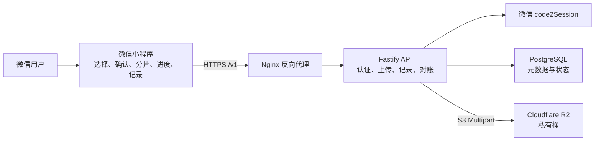
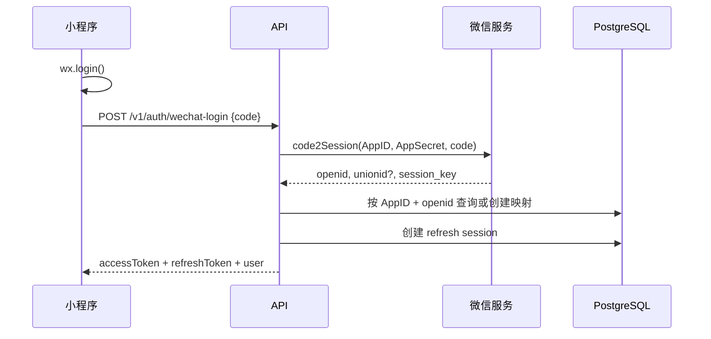
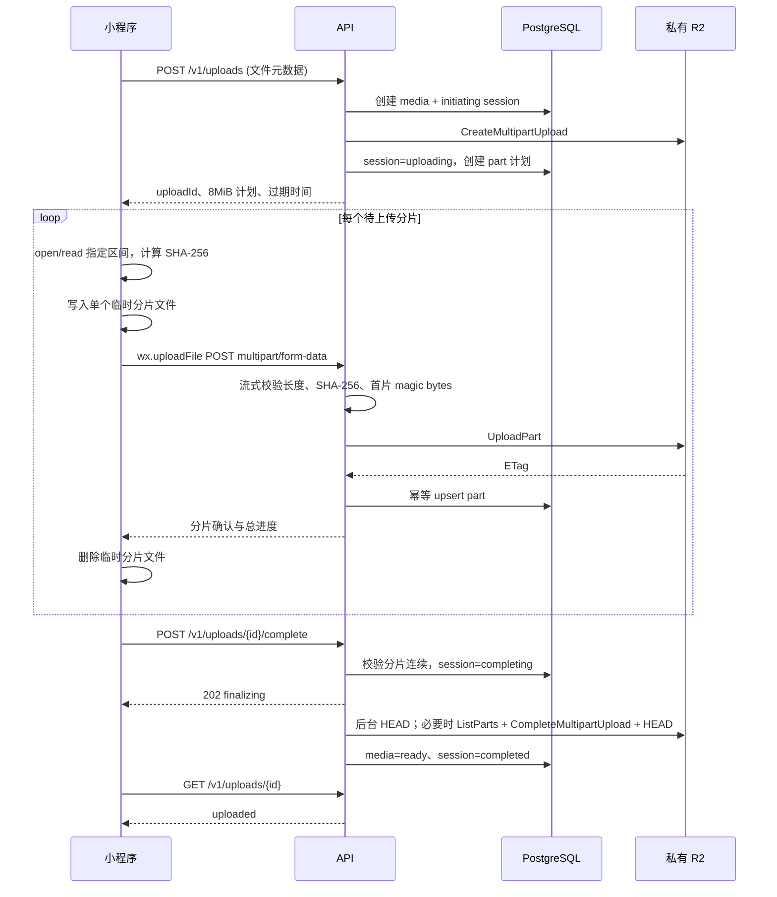

# 微信小程序私有素材上传系统架构设计

> 文档状态：待评审
> 版本：1.0
> 日期：2026-07-14
> 关联文档：[接口设计](../../api/media-upload-api.md) · [数据库设计](../../database/media-upload-database.md)

## 1. 决策摘要

系统采用一个代码仓库和两个首期应用：

- `apps/miniprogram`：微信原生小程序，TypeScript。
- `apps/api`：Node.js + TypeScript + Fastify 业务后端。
- PostgreSQL 保存身份、上传、分片、对象元数据及审计数据。
- Cloudflare R2 保存原始图片和视频，桶保持私有，不开启 `r2.dev` 或公开自定义域名。
- 小程序只访问业务 HTTPS 域名，不直接访问 R2，也不接触 R2 凭据、对象键或下载地址。
- 单文件上限明确为 `200 MiB = 209,715,200 bytes`；客户端和服务端之间采用固定 `8 MiB` 分片。
- 后端使用 R2 S3 Multipart API 写入分片；失败时只重传失败分片。冷启动后只有原微信临时路径仍可读取且已上传分片哈希匹配时才续传；源文件失效时重新选择、二次确认并创建新上传。
- 完整对象默认长期保留；首版没有用户删除、公开预览、分享或自动清理完整对象的能力。

## 2. 背景与目标

用户打开小程序后直接进入素材上传页。系统自动完成微信身份登录，用户选择图片或视频、进行二次确认、查看真实上传进度，并在上传记录中看到素材是否已成功写入私有 R2。

每个微信身份通过 `openid` 映射到内部用户 ID。R2 对象按内部用户 ID 前缀组织，既便于运维管理，也避免把 `openid` 或昵称暴露在对象路径中。

### 2.1 首版目标

1. 使用 `wx.login` 和服务端 `code2Session` 建立可靠登录态。
2. 保存 `openid → 内部 userId → 用户确认昵称` 的映射。
3. 首次上传前，通过 `<input type="nickname">` 让用户一键选择微信推荐昵称并确认。
4. 支持一次选择最多 9 个图片或视频文件。
5. 选择后展示文件数量、名称、类型、单文件大小和总大小，并要求用户再次确认。
6. 支持 12 bytes 至 200 MiB 的单文件上传、分片进度、失败重试和断点续传。
7. 向用户展示自己的上传记录，不返回对象下载地址。
8. 保证 R2 全程私有，并提供可审计的身份和上传状态。

### 2.2 首版非目标

- 不提供用户侧素材预览、下载、分享或删除。
- 不建设管理员 Web 控制台。
- 不把昵称当作可信身份凭证；昵称仅是与内部用户关联的可变展示资料。
- 不支持音频、PDF、压缩包、SVG、HTML 或可执行文件。
- 不自动删除已经上传完成的 R2 对象。
- 未来 QNAP NAS 与 R2 的自动同步、同步凭据、计划任务、完整性校验及同步后的删除策略不属于当前版本；需要时另行设计。

## 3. 前提与固定约束

| 项目 | 约束 |
|---|---|
| 服务端基础 | 已有可部署 Linux 后端服务器和 HTTPS 域名，当前为空环境 |
| 小程序 | 单一微信小程序 AppID，原生 TypeScript 项目 |
| 服务端 | Node.js 24 LTS、Fastify、PostgreSQL 17 |
| 文件类型 | 图片和视频白名单，详见接口文档 |
| 单文件大小 | 12 bytes 至 200 MiB；同时必须满足格式签名校验 |
| 分片大小 | 8 MiB，最后一片可小于 8 MiB |
| 分片数量 | 1 至 25 |
| 上传会话 | 创建后 24 小时停止接受新分片或新的 complete；已进入 completing 的会话必须先对账收敛 |
| 访问模型 | 用户无对象读取接口；只有业务后端持有 R2 访问凭据 |
| 对象保留 | 完整对象不设自动删除生命周期 |
| 时间 | API 与数据库统一使用 UTC，界面按设备时区展示 |

## 4. 总体架构



### 4.1 信任边界

- 小程序属于不可信客户端。文件名、MIME、大小、用户 ID、分片号和进度均需服务端重新验证。
- Nginx 与 API 是唯一公网业务入口。R2 S3 endpoint 不配置为小程序服务器域名。
- PostgreSQL、R2 读写凭据、微信 AppSecret 和 JWT 私钥只存在于服务端秘密管理中。

## 5. 组件职责

| 组件 | 职责 | 不负责 |
|---|---|---|
| 微信小程序 | 登录、昵称确认、素材选择、二次确认、分片制作、上传进度、断点恢复、记录展示 | 决定 userId、生成对象键、接触 R2 凭据 |
| Nginx | TLS 终止、限流、请求体上限、请求转发、基础访问日志 | 缓存上传请求体、处理业务状态 |
| Fastify API | 微信登录、令牌、鉴权、文件校验、R2 multipart、状态机、上传记录和审计 | 向用户提供对象读取或公开链接 |
| PostgreSQL | 身份映射、会话、上传会话、分片、对象元数据、幂等和审计 | 保存文件二进制 |
| Cloudflare R2 | 保存完整私有对象和未完成 multipart | 直接认证微信用户 |

## 6. 代码仓库设计

```text
wx_mini_program/
├── apps/
│   ├── miniprogram/       # 原生微信小程序
│   └── api/               # Fastify API、定时清理与对账任务
├── packages/
│   └── contracts/         # API DTO、状态枚举、错误码与 JSON Schema
├── deploy/
│   ├── docker-compose.yml
│   ├── nginx/
│   └── scripts/
├── docs/
└── pnpm-workspace.yaml
```

`packages/contracts` 是接口语义的单一来源，但不得包含任何服务端秘密。小程序只引入可序列化 DTO、状态与错误码类型。

## 7. 核心业务流程

### 7.1 登录与用户映射



- `openid` 的唯一范围是当前 AppID；数据库使用 `(provider, app_id, openid)` 唯一约束。
- 服务端生成 UUIDv7 内部用户 ID。`openid`、`unionid` 和 `session_key` 不返回客户端。
- 首版不依赖微信敏感数据解密，`session_key` 只在本次登录交换的进程内存中短暂存在，不写数据库、缓存或日志。
- Access Token 有效期 15 分钟；Refresh Token 有效期 30 天并每次使用时轮换。
- 数据库只保存 Refresh Token 的 SHA-256 摘要；发现旧 Token 重用时撤销整个 token family。

### 7.2 昵称确认

微信已不允许新小程序通过授权弹窗直接读取真实默认昵称。本系统采用官方昵称填写能力：

1. 登录后若 `nicknameConfirmed=false`，用户仍可进入上传页和选择素材。
2. 用户第一次点击“确认上传”时展示昵称确认区域。
3. `<input type="nickname">` 在键盘上方展示微信昵称候选，用户点击候选并确认。
4. 小程序调用 `PUT /v1/profile/nickname` 保存昵称。
5. 后端验证字符、长度与控制字符，保存 `nickname_confirmed_at`。

昵称填写组件没有可供后端验证的昵称签名，因此该映射的语义是“此 openid 对应用户明确确认的展示昵称”，不是微信官方身份认证结果。昵称可重复、可修改，也绝不参与对象权限判断。

### 7.3 选择与二次确认

1. 小程序通过 `wx.chooseMedia` 选择最多 9 个图片或视频。
2. 客户端先检查类型、大小和文件可读性；服务端仍会再次校验。
3. 确认页展示文件列表、单文件大小、总大小，并提供“取消”和“开始上传”。
4. 用户确认后才创建服务端上传会话；取消不会生成 R2 multipart。
5. 上传队列默认一次处理一个文件，同一文件最多并行两个不同分片，控制内存和移动网络竞争。

### 7.4 分片上传



`complete` 是明确的异步边界：请求只负责把可完成的会话持久化为 `completing` 并返回 `202 finalizing`；API 内的持久化 finalizer 每秒只扫描 `next_finalize_at` 已到期的候选，并对 `uploadId` 取得 PostgreSQL session-level advisory lock 后执行 R2 完成和 HEAD，避免多实例并发处理且不跨网络持有事务。失败次数、上次错误和下一次执行时间写入数据库，使用最大 5 分钟的 full-jitter 退避。它不依赖进程内队列，因此返回后进程重启也不会丢任务；每 5 分钟的对账扫描只负责修复长时间卡住的异常记录。

采用临时分片文件而非整文件 `wx.uploadFile`，原因如下：

- `UploadTask.onProgressUpdate` 可以提供当前分片的真实上传进度。
- 网络失败只需重传一个 8 MiB 分片，而非整个 200 MiB 文件。
- 小程序一次只保留最多两个 8 MiB 临时分片，上传确认后立即删除，不占满本地 200 MiB 缓存配额。
- 业务服务器只接收小分片，Nginx 无需允许 200 MiB 单请求。

总体进度按以下公式计算，其中 `inFlight` 只包含尚未被服务端确认的在途分片：

```text
progress = min(1,
  (authoritativeConfirmedBytes
   + Σ min(inFlightPart.sentBytes, inFlightPart.expectedBytes))
  / fileSizeBytes
)
```

每次分片响应到达后，客户端先把该分片从 `inFlight` 移除，再以
`max(本地 authoritativeConfirmedBytes, 响应 confirmedBytes)` 更新权威值，避免两个并发响应乱序造成回退或重复计数。界面值限制在 0–100%，同一次上传内保持单调不下降；重新恢复时以服务端值重新建立基线。

### 7.5 续传与重试

- 每个分片最多自动重试 5 次，使用 full-jitter：`random(0, min(2^retryIndex, 30))` 秒，`retryIndex` 从 0 开始。
- 网络错误、`408`、`429`、`502`、`503`、`504` 以及响应明确标记 `retryable=true` 的错误可以重试；其他 4xx 不自动重试。
- 小程序进入后台时停止发起新请求并保存 `uploadId`、源临时路径和文件元数据；回到前台后先查询服务端分片状态。
- 冷启动时先尝试重新打开原临时路径，并对所有已上传分片重新计算 SHA-256 与服务端记录逐片比对；全部匹配后才只上传缺失分片。路径失效或任一哈希不匹配时禁止复用旧会话：客户端以 `reason=replaced` 中止旧记录，要求用户重新选择、再次二次确认并创建全新的上传。
- 同一 `uploadId + partNumber + SHA-256` 是自然幂等操作。相同内容重复提交返回已有结果。
- `initiating/uploading` 会话在 24 小时后停止接受分片和 complete，并进入安全终止流程。已在截止前进入 `completing` 的会话不因年龄直接过期，必须先用 HEAD/ListParts 判断 R2 事实并收敛；上游结果未知时始终保持 `completing`。
- R2 未完成 multipart 的 7 天自动终止策略作为服务端清理失败时的安全兜底。

### 7.6 上传记录

用户记录页只返回自己的聚合状态，不返回 R2 bucket、object key、ETag 或访问地址：

| 用户状态 | 含义 |
|---|---|
| `uploading` | 分片尚未全部确认 |
| `finalizing` | R2 正在完成与对账 |
| `cancelling` | 正在终止未完成的 R2 multipart |
| `uploaded` | 完整私有对象已写入 R2 并通过大小校验 |
| `upload_failed` | 上传或 R2 完成失败 |
| `aborted` | 用户取消未完成上传 |
| `expired` | 上传会话超时 |

内部 `upload_sessions.completed + media_objects.ready` 对外统一投影为成功终态 `uploaded`；当前版本之后没有其他业务处理状态。

## 8. 对象键与文件校验

R2 对象键由后端生成：

```text
users/{userId}/{image|video}/{yyyy}/{mm}/{mediaId}{canonicalExtension}
```

示例：

```text
users/019bfae0-7b1a-7c32-a9fd-6dfb0ce51234/video/2026/07/019bfae2-1b5a-7890-b7ad-50ad78c41234.mp4
```

规则：

- `userId` 和 `mediaId` 均由服务端生成。
- `canonicalExtension` 包含前导点，例如 `.jpg`、`.mp4`。
- 原文件名只保存为展示元数据，不能参与对象键拼接。
- 路径不包含 `openid`、昵称、设备信息或用户提交的目录。
- 第一片上传时检查 magic bytes；声明 MIME、扩展名和检测类型必须兼容。
- 完成后通过 R2 `HEAD` 核对最终字节数和对象元数据。
- Multipart ETag 不能当作完整文件 MD5。首版保存每个分片的 SHA-256，并在完成后通过 `HEAD` 校验对象总字节数；不宣称已经得到完整对象的 SHA-256。

## 9. 状态与一致性

### 9.1 上传会话状态

```text
initiating -> uploading -> completing -> completed
     |           |             |
     v           v             v
   failed     aborting       failed
                  |
             aborted/expired
```

`completing` 结果不确定时不能直接创建第二个对象。对账任务按固定 object key 执行 `HEAD`：

- 对象存在且大小匹配：补齐数据库的 `completed/ready` 状态。
- Multipart 仍存在：继续安全完成或回到可重试上传状态。
- 对象和 multipart 均不存在：标记不可恢复失败。

24 小时清理任务只扫描 `initiating/uploading`。`completing` 只有在 HEAD 明确对象不存在、ListParts 明确 multipart 尚未完成且上传截止时间已过时，才可转 `aborting`，成功终止 multipart 后投影为 `expired`；任何 R2 超时或结果未知都不得按年龄标记过期。

### 9.2 跨 PostgreSQL 与 R2 的一致性

PostgreSQL 与 R2 没有分布式事务，系统使用 Saga + Reconciliation：

- 初始化先在数据库占用幂等键和对象键，再创建 R2 multipart。
- 若 R2 已创建 multipart 但 API 在保存 `r2_upload_id` 前崩溃，`initiating` 对账按唯一 object key 列出并终止对应 multipart；列举或终止持续失败时由 R2 7 天生命周期兜底。
- R2 分片成功但数据库写入失败时，重传同 part number 即可覆盖并恢复。
- 完成前先把数据库切换到 `completing`，避免新分片进入。
- 完成后用 `HEAD` 验证，再在单事务中更新媒体与上传会话。
- 定时对账每 5 分钟扫描长时间处于 `initiating`、`completing`、`aborting` 的记录。

## 10. 安全设计

### 10.1 身份与授权

- 所有用户接口从 Access Token 的 `sub` 解析 userId，忽略客户端提交的 userId。
- 不属于当前用户的资源统一返回 `404`，防止枚举。
- Refresh Token 轮换、撤销和重用检测均由数据库会话控制。

### 10.2 文件安全

- 服务端同时验证文件大小、分片大小、分片号、SHA-256、扩展名、MIME 与首片 magic bytes。
- 明确拒绝 SVG、HTML、脚本、压缩包与可执行文件。
- 文件名执行 Unicode NFC、basename 和控制字符清理，但只用于显示。
- API 不执行、解压或渲染上传内容。

### 10.3 存储与秘密

- R2 bucket 关闭 public access，不启用公开域名。
- API 使用限定到单个 bucket 的读写凭据；小程序不持有 R2 凭据。
- 微信 AppSecret、R2 Secret Access Key、JWT 私钥和数据库密码均通过部署秘密注入。
- 日志不得记录 openid、session_key、完整 Token、R2 Secret 或用户文件内容。

### 10.4 网络与滥用防护

- 业务域名配置到微信小程序“服务器域名”白名单。
- TLS 最低 1.2，生产环境强制 HSTS。
- 登录、上传初始化和分片接口分别限流。
- 每用户最多 5 个未完成上传；每上传最多 2 个并行分片；每用户最多 4 个分片请求。
- JSON 请求体上限 64 KiB，分片请求体上限 16 MiB。

## 11. 错误处理

| 场景 | 行为 |
|---|---|
| 微信登录服务临时不可用 | 返回可重试错误，不创建匿名本地身份 |
| 昵称缺失 | 上传初始化返回 `NICKNAME_REQUIRED`，不创建 R2 multipart |
| 文件不足 12 bytes 或无法检查格式签名 | 客户端先阻止，服务端返回 `422 FILE_TOO_SMALL` |
| 文件超过 200 MiB | 客户端先阻止，服务端返回 `413 FILE_TOO_LARGE` |
| 分片网络中断 | 不计入已确认字节，重传同一 part number |
| 分片哈希不符 | 返回 `PART_CHECKSUM_MISMATCH`，删除临时分片并重新读取 |
| R2 UploadPart 超时 | 查询数据库状态后按相同 part number 重试 |
| Complete 结果未知 | 保持 `completing`，由 `HEAD/ListParts` 对账 |
| 小程序进入后台 | 停止新请求，回前台后查询服务端进度 |
| 数据库短暂不可用 | 不确认分片成功，客户端按幂等规则重试 |

## 12. 可观测性

### 12.1 日志字段

使用 JSON 结构化日志，至少包含：

- `timestamp`、`level`、`service`、`environment`
- `requestId`、`route`、`method`、`statusCode`、`durationMs`
- `userId`、`mediaId`、`uploadId`、`partNumber`（存在时）
- `errorCode`、`retryable`、`upstream`

### 12.2 指标

- 登录成功率、微信上游延迟与错误率。
- 上传初始化数、活跃上传数、上传字节数。
- 分片成功率、重试率、延迟、哈希不匹配数。
- R2 Create/UploadPart/Complete/Abort/HEAD 延迟与错误率。
- `completing` 超时数、对账修复数、过期会话数。

### 12.3 告警

- 5 分钟窗口登录或分片错误率超过 5%。
- R2 或 PostgreSQL 连续 3 次健康检查失败。
- `completing` 超过 15 分钟或 `initiating` 超过 5 分钟。
- PostgreSQL 备份失败或恢复校验失败。

## 13. 性能与容量

- 客户端分片为 8 MiB，服务端必须流式读取 multipart 文件字段，禁止一次性转为 Buffer。
- Nginx 设置 `client_max_body_size 16m`、关闭上传请求缓冲，并将上传上游读取超时设为至少 210 秒。
- API 到 R2 的单分片超时必须短于客户端总超时，建议 150 秒。
- 初始单实例建议至少 2 vCPU、4 GiB 内存；数据库连接池上限 20。
- API 保持无状态，可在共享 PostgreSQL 前横向扩容。分片并发与 finalizer 互斥不能只使用进程内锁。
- 本地磁盘不保存服务端上传文件；临时分片只存在用户设备并及时删除。

## 14. 部署设计

Docker Compose 首期服务：

- `nginx`：公网 443，反向代理 API。
- `api`：Fastify HTTP 服务与定时对账/清理任务。
- `postgres`：仅内网可访问，持久化卷。
- `migrate`：一次性数据库迁移任务。

生产配置：

1. DNS 将 API 子域名解析到业务服务器。
2. HTTPS 证书覆盖该完整子域名。
3. 微信小程序后台配置该域名为 request/uploadFile 合法域名。
4. 防火墙只开放 22（限定管理来源）、80（证书跳转）和 443；5432 不对公网开放。
5. 开发、测试、生产使用独立数据库、R2 bucket、微信配置和密钥。
6. 发布顺序为数据库 expand migration、API、兼容的小程序版本，破坏性 contract migration 延后执行。
7. Nginx 的分片路由设置 `client_max_body_size 16m`、`proxy_request_buffering off` 和不低于 210 秒的上游读取超时；其他 JSON 路由仍限制为 64 KiB。
8. Fastify multipart 只接受名为 `chunk` 的单个文件字段，文件内容上限 8 MiB，并在解析时流式转发；禁止把整个分片读入内存。

## 15. 备份与保留

- PostgreSQL 每日备份，保留 7 个日备、4 个周备和 3 个年/月度恢复点；每月至少完成一次独立环境恢复验证。
- 完整 R2 对象首版长期保留，不配置完成对象自动删除规则。
- 未完成 R2 multipart 默认 7 天自动终止；应用对超过 24 小时的 `initiating/uploading` 主动终止，`completing` 必须先对账。
- 终态上传会话摘要与媒体对象长期保留，保证历史记录和 `uploadId` 可查询；分片明细在终态 90 天后删除。
- 已撤销或过期 Refresh Session 保留 90 天后删除。
- 在线审计事件保留 365 天，清理使用独立维护角色。
- PostgreSQL 备份不包含 R2 对象；需要跨账户对象灾备时应作为独立后续项目实施。

## 16. 测试策略

### 16.1 单元测试

- 文件名、昵称、MIME、大小和分片边界校验。
- 对象键生成与路径逃逸防护。
- 状态机和错误码映射。
- JWT 与 Refresh Token 轮换验证。
- 进度计算、退避和游标分页。

### 16.2 集成测试

- PostgreSQL 唯一约束、事务和幂等记录。
- 使用独立测试 R2 bucket 验证 multipart create/upload/list/complete/abort/head。
- 模拟 R2 成功但数据库失败，以及 R2 超时但实际完成的对账恢复。
- 同一分片并发提交、重复提交和不同内容覆盖冲突。

### 16.3 端到端与真机测试

边界文件：

- 11 bytes（拒绝）、各格式最小签名测试样本、5 MiB、8 MiB、8 MiB + 1 byte。
- 199 MiB、200 MiB、200 MiB + 1 byte。
- JPEG、PNG、WebP、GIF、HEIC/HEIF、MP4、MOV。
- 扩展名与 magic bytes 不匹配文件。

场景：

- 首次登录与昵称确认。
- 二次确认取消和确认。
- Wi-Fi/蜂窝网络切换、弱网、断网、进入后台；杀进程后临时路径仍有效时续传，以及路径失效后中止旧记录并重选新建上传。
- 多文件队列、部分失败、会话过期。

## 17. 开发阶段

1. 初始化 monorepo、共享 contracts、代码质量与 CI。
2. 建立 PostgreSQL schema、迁移和本地 Docker Compose。
3. 实现微信登录、用户映射、Token 轮换与昵称确认。
4. 建立私有 R2、后端 multipart 适配和上传状态机。
5. 实现小程序选择、二次确认、临时分片、进度、重试与续传。
6. 实现上传记录、游标分页和聚合状态。
7. 完成 Nginx、生产部署、监控、备份和恢复演练。
8. 完成测试矩阵、微信真机验收和上线检查。

## 18. 验收标准

- 新用户打开小程序可自动登录，首次确认上传时可一键选择微信推荐昵称。
- 未确认昵称、文件超限或类型不符时，R2 不产生可用完整对象。
- 用户选择后必须二次确认；取消不创建上传会话。
- 200 MiB 合法视频可在真机完成上传，并显示真实进度。
- 中断后重新进入小程序；源路径仍有效且已确认分片哈希全部匹配时只重传缺失分片，源路径失效时中止旧记录并在重新选择、二次确认后新建上传。
- 每个完整对象只存在于当前用户内部 ID 前缀下，用户接口不返回任何对象读取能力。
- 用户只能看到自己的上传记录。
- R2 bucket 无公开访问；微信 AppSecret、R2 凭据、JWT 私钥和数据库密码不出现在客户端包、API 响应或日志中。
- 关键异常场景可通过对账任务恢复，且所有状态变更有审计记录。

## 19. 官方参考

- [微信小程序登录](https://developers.weixin.qq.com/miniprogram/dev/framework/open-ability/login.html)
- [微信头像昵称填写](https://developers.weixin.qq.com/miniprogram/dev/framework/open-ability/userProfile.html)
- [`wx.uploadFile`](https://developers.weixin.qq.com/miniprogram/dev/api/network/upload/wx.uploadFile.html)
- [`FileSystemManager.open`](https://developers.weixin.qq.com/miniprogram/dev/api/file/FileSystemManager.open.html)
- [`FileSystemManager.read`](https://developers.weixin.qq.com/miniprogram/dev/api/file/FileSystemManager.read.html)
- [微信小程序网络能力](https://developers.weixin.qq.com/miniprogram/dev/framework/ability/network.html)
- [Cloudflare R2 上传对象](https://developers.cloudflare.com/r2/objects/upload-objects/)
- [Cloudflare R2 S3 API](https://developers.cloudflare.com/r2/api/s3/api/)
- [Cloudflare R2 生命周期](https://developers.cloudflare.com/r2/buckets/object-lifecycles/)
